## Important
As I had problems with the acls in relation with the NAT configuration, I decided to attacht also and all version I had previusly of the ACL configuration and VOIP configuration. The name of the file is OLD_VERSION. Here I can demostrate the nat was correctly configure.
## ACL
ACLs:
101 - interface closer to the isp
100 - Backbone's subinterface
102 - DMZ 's subinterface
104 - rest of subinterfaces
1- Internal Spoofing

Applied to all subinterfaces excluding dmz.
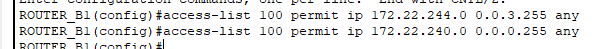
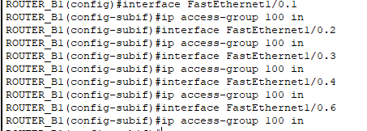

For the backbone's subinterface
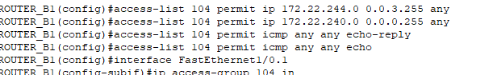
2. External spoofing
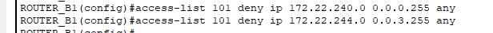
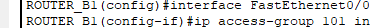

3. ICMP ECHO

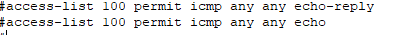
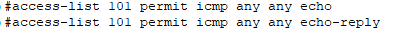

4. DMZ IN

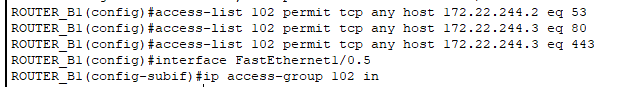

5. DHCPv4

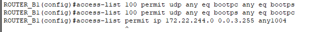

6. TFTP

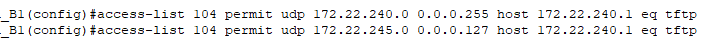

7. OSPF

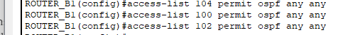